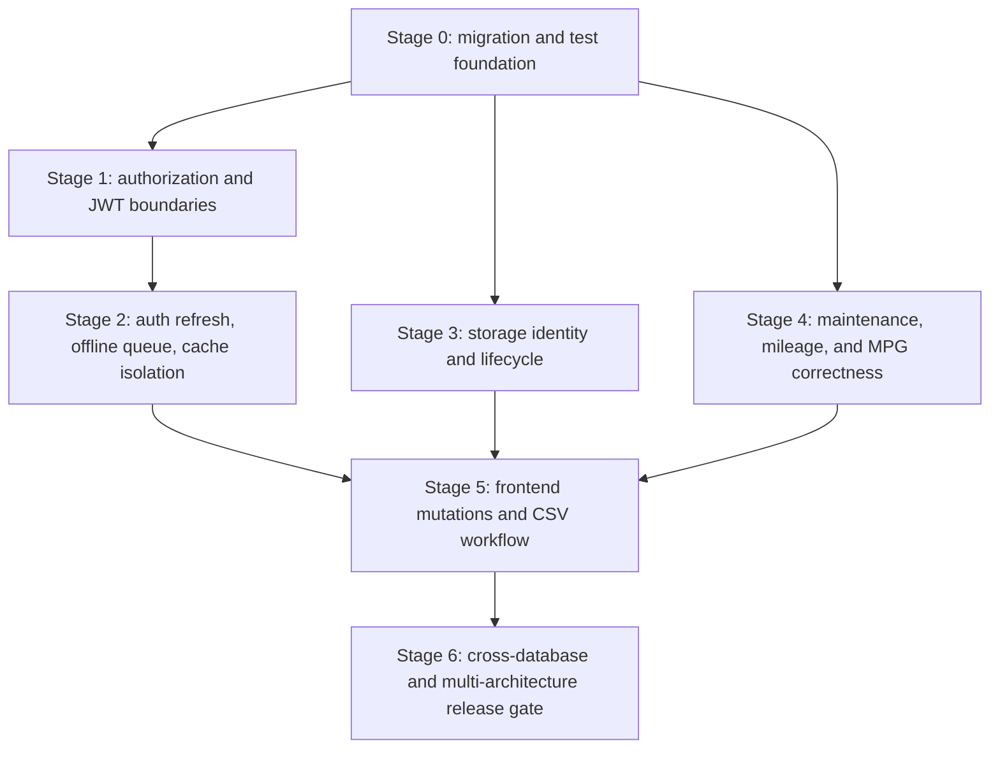
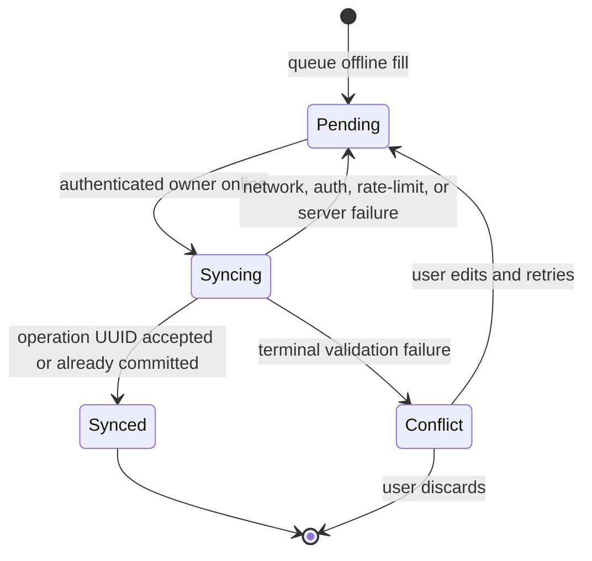

# Codebase Audit Findings - Plan

## Goal Capsule

- **Objective:** Eliminate the confirmed security, data-loss, correctness, and frontend reliability defects without regressing partial fill-ups or unrelated work in the current dirty worktree.
- **Authority:** This plan and its R/KTD/U IDs define the repair scope. Existing user changes remain authoritative where they overlap.
- **Execution profile:** Deliver in dependency-ordered stages. Each stage must pass its own regression gate before dependent work starts.
- **Stop conditions:** Stop if a migration cannot preserve existing SQLite, PostgreSQL, and MySQL data; if a storage switch cannot preserve every referenced object; or if a proposed fix changes user-visible mileage semantics beyond R12.
- **Tail ownership:** Completion includes automated verification, upgrade checks, multi-architecture Docker builds, image inspection, and durable learnings.

---

## Product Contract

### Summary

Repair every confirmed audit finding in risk order. Establish reliable migrations first, then secure authorization and authentication, protect offline and cached data, make blob storage recoverable, correct domain calculations, standardize frontend failure behavior, and finish with rollout verification.

### Problem Frame

The audit found authorization bypasses, refresh deadlocks, cross-account browser leakage, silent offline-data deletion, blob overwrite and orphan paths, fail-open migrations, stale reminder and odometer state, inaccurate MPG, and UI flows that report success after failure. Several fixes need new persistent fields. The current startup migration mechanism suppresses errors, so schema reliability must precede those fixes.

The repository also contains in-progress partial-fill work and unrelated brand assets. The repair must preserve both and extend the partial-fill calculation service rather than replacing it.

### Requirements

**Authorization and authentication**

- R1. Only an explicit installation administrator may read, test, or change instance-wide database, storage, integration, and credential-consuming OCR settings.
- R2. A vehicle owner may mutate only collaborator records that belong to the requested vehicle.
- R3. Protected routes must accept access tokens only; production must reject weak signing configuration; refresh sessions must rotate, revoke, and settle all concurrent callers without recursion or hanging.

**Offline and browser isolation**

- R4. Offline fuel entries must remain associated with their originating user and survive every retryable or authentication failure.
- R5. Retried offline submissions must create at most one fuel entry, including when the server committed but the client lost the response.
- R6. Authenticated API responses and user-specific browser state must never cross account boundaries on the same browser profile.

**Migrations and storage integrity**

- R7. Schema upgrades must be repeatable, observable, and fatal on failure across supported database engines.
- R8. Every uploaded object must have a collision-resistant immutable key and a durable storage identity.
- R9. A storage-backend switch must copy and verify referenced objects before cutover or reject the switch without changing the active backend.
- R10. Upload, deletion, vehicle deletion, and storage failures must not leave an untracked blob, dangling database reference, or false-success response.
- R11. Documents may reference maintenance entries only from the same vehicle, and primary-photo selection must be deterministic.

**Domain correctness**

- R12. `Vehicle.current_mileage` is a monotonic absolute odometer observation; trip records contribute analytics totals but do not delta-mutate it.
- R13. Maintenance-entry and reminder mutations must derive reminder state from current authoritative history in one transaction.
- R14. Completing a reminder must create at most one maintenance record and advance the reminder atomically.
- R15. Average MPG must equal total valid interval miles divided by total valid interval gallons under the same missed-fill and partial-fill rules used for entry MPG.

**Frontend workflow integrity**

- R16. Delete flows must report success only after a successful or idempotently absent server result and must retain or restore UI state after failure.
- R17. CSV export/import must round-trip quoted, comma-containing, CRLF, and multiline values and must not leave a partially imported batch.
- R18. Malformed or cross-user local browser data must not crash a page or leak into another account.

**Release safety**

- R19. Existing partial-fill behavior and unrelated dirty-worktree changes must remain intact.
- R20. Each confirmed audit finding must have a named regression scenario and a stage-specific verification gate.
- R21. Release validation must include upgrade fixtures, frontend checks, runtime smoke tests, and `linux/amd64` plus `linux/arm64` image inspection.

### Acceptance Examples

- AE1. Given a non-admin vehicle owner, when they call any instance settings or OCR route, then the API returns a permission denial and changes no configuration. Covers R1.
- AE2. Given an owner of vehicle A and a collaborator ID from vehicle B, when the owner requests deletion through vehicle A, then no collaborator is deleted. Covers R2.
- AE3. Given concurrent requests with an expired access token and an invalid refresh token, when refresh fails, then one refresh attempt occurs and every caller rejects promptly. Covers R3.
- AE4. Given an offline fill committed before a lost response, when the same queued operation retries, then one fuel entry exists and the queue resolves. Covers R4-R5.
- AE5. Given user A cached or queued private data, when user B signs in on the same browser, then user B cannot receive, view, or submit user A's data. Covers R6 and R18.
- AE6. Given existing documents on backend A, when an administrator switches to backend B, then cutover occurs only after every referenced object is copied and verified; otherwise backend A remains active. Covers R8-R10.
- AE7. Given a later absolute fuel odometer reading, when an older trip is edited or deleted, then current mileage never decreases. Covers R12.
- AE8. Given a maintenance record whose type, mileage, date, or existence changes, when the transaction commits, then affected reminders match the latest remaining history. Covers R13-R14.
- AE9. Given unequal valid fuel intervals and accumulated partial fills, when stats are requested, then average MPG is computed from aggregate valid miles and gallons. Covers R15.
- AE10. Given an imported CSV with escaped quotes and multiline text plus one invalid row, when validation runs, then the text parses correctly and zero rows persist. Covers R17.

### Scope Boundaries

In scope are all confirmed audit findings, the test scaffolding needed to prove them, schema and rollout work required by those fixes, and small shared services that remove duplicated correctness rules.

#### Deferred to Follow-Up Work

- A general mileage event ledger is deferred. This plan enforces the current absolute-odometer contract and removes trip delta mutation.
- User-selectable primary-photo UI is deferred unless needed to preserve existing behavior. Deterministic server selection is in scope.
- General background-job infrastructure is deferred. Storage cleanup may use a small persisted retry queue and an explicit maintenance command.
- Broad component extraction from `VehicleDetailPage.tsx` is deferred. Only testability seams required by R16-R18 are in scope.
- Dependency upgrades are outside this repair unless a current pin blocks a required test or migration behavior.

---

## Planning Contract

### Key Technical Decisions

- KTD1. **Stage the work behind verification gates.** (session-settled: user-approved — chosen over one combined repair: isolating security, persistence, and UI changes reduces rollback risk.) Each stage must satisfy its tests before the next dependent stage begins.
- KTD2. **Adopt Alembic as the sole schema migration path.** A one-time reconciler fingerprints known legacy schema variants, rejects unknown drift, reconciles each known variant to one baseline, and stamps it. Normal startup then runs versioned upgrades that stop startup on failure.
- KTD3. **Represent installation administration on `User`.** Backfill the earliest existing user as the initial administrator and enforce access through one reusable backend dependency. Vehicle ownership never implies instance administration.
- KTD4. **Separate JWT purposes and persist refresh-session state.** Access and refresh tokens carry distinct types. Hashed refresh JTI records support atomic rotation, replay-family revocation, logout revocation, and password-change invalidation. Production readiness rejects default, blank, or weak signing secrets. The frontend uses an interceptor-free refresh client, permits one retry per request, and always settles the shared queue. This follows [RFC 8725](https://www.rfc-editor.org/rfc/rfc8725) guidance to prevent one JWT kind from being accepted in another context.
- KTD5. **Make offline writes user-scoped and payload-bound.** Store the submitting user, operation UUID, vehicle, canonical payload hash, and result identity in the same transaction as the fuel write. Replay returns the original result only after authorization and only when the vehicle and payload hash match; conflicting reuse is rejected. Unowned legacy queues remain quarantined until the user claims or discards them.
- KTD6. **Do not cache authenticated API responses in the service worker.** Keep offline caching for static assets and the application shell. Activation and account transitions purge every legacy Tracktion cache before the new worker claims clients. The Cache API stores request/response pairs in persistent named caches, so URL-only API caching is unsafe for account switching ([MDN Cache API guidance](https://developer.mozilla.org/en-US/docs/Web/Progressive_web_apps/Guides/Caching)).
- KTD7. **Give each object an immutable storage profile and UUID key.** A profile captures the backend endpoint, bucket, and base path that define object identity. User filenames remain metadata only.
- KTD8. **Switch storage through a durable copy-verify-cutover ledger.** (session-settled: user-approved — chosen over silently changing the active backend: existing files must not be stranded.) Per-object states make migration resumable. One short transaction changes document references and activates the candidate only after every referenced object verifies; source objects remain authoritative until then and remain retained through a defined rollback window.
- KTD9. **Track every object through a persisted lifecycle.** Create an upload intent before object creation. Live references, tombstones, and cleanup intents form the recovery contract, so failure of both a database write and compensating deletion cannot create an untracked object.
- KTD10. **Centralize derived domain state with concurrency control.** Reminder derivation, absolute mileage advancement, and weighted fuel aggregation belong in backend services. Row locking or atomic conditional updates and a consistent lock order protect reminder and mileage invariants across concurrent requests.
- KTD11. **Use transactional, idempotent bulk import endpoints.** Parse RFC 4180 CSV in the client, validate the full typed batch on the server, and commit once under an import operation UUID.
- KTD12. **Prefer state-after-success frontend mutations.** Treat not-found deletion as converged success; permission, network, rate-limit, and server failures retain visible state and show one error.

### High-Level Technical Design





```mermaid
sequenceDiagram
  participant Admin
  participant API
  participant Old as Active storage
  participant New as Candidate storage
  participant DB
  Admin->>API: request storage switch
  API->>New: validate candidate
  API->>Old: read referenced objects
  API->>New: copy with new immutable keys
  API->>New: verify copied objects
  alt all verified
    API->>DB: commit object references and active profile
    API-->>Admin: switch complete
  else any failure
    API->>New: compensate copied objects
    API-->>Admin: failure; old profile remains active
  end
```

### System-Wide Impact

- **Users:** Non-admin accounts lose access to instance settings and OCR. Offline conflicts become recoverable instead of disappearing.
- **Data lifecycle:** Database migrations, blob identity, cleanup state, and browser storage gain explicit ownership and failure states.
- **Operations:** Startup becomes migration-gated. Storage switching becomes an observable migration rather than a configuration flip.
- **Developers:** Route tests and frontend unit tests become required infrastructure because builds alone cannot prove concurrency, cache, or error-state behavior.
- **Compatibility:** Additive schema changes must tolerate the current frontend during the migration release. Runtime code may require new columns only after the migration gate succeeds.

### Risks and Mitigations

- **Existing-schema variance:** Current installations may contain different subsets of ad-hoc columns. Build fixtures for pre-partial-fill, current partial-fill, and partially upgraded schemas before retiring `run_migrations()`.
- **Storage cutover duration:** Large libraries may exceed a request timeout. Keep migration state resumable by object and never activate the candidate profile until verification completes.
- **Credential retention:** Immutable profiles need access to old backends. Keep credentials write-only, reference protected and versioned secret records, redact responses/logs/provider errors, and define rotation and retirement separately from endpoint identity.
- **Migration rollback:** Some forward migrations may not be downgrade-safe. Require a verified backup before upgrade, classify each revision, and use backup restore plus the prior image when a forward-only revision must be rolled back.
- **Cleanup races:** A retry worker must never delete a referenced object. Resolve the database reference and cleanup state again immediately before deletion.
- **Secret multiplication:** Old storage profiles can duplicate credentials or leak them through tests and logs. Separate immutable endpoint identity from versioned credential references, define rotation and retention, and test API, log, and exception redaction.
- **Frontend test gap:** The repository has no frontend test runner. Add a minimal Vite-compatible runner without upgrading unrelated dependencies.
- **Dirty worktree overlap:** Several target files contain partial-fill and unrelated user changes. Patch narrow regions and inspect diffs after every stage.

---

## Implementation Units

### Stage 0 - Migration and Regression Foundation

### U1. Establish route and frontend test harnesses

- **Goal:** Add the smallest test infrastructure that can prove API authorization, transaction behavior, Axios concurrency, browser storage, service-worker caching, and CSV parsing.
- **Requirements:** R19-R20.
- **Dependencies:** None.
- **Files:** `backend/tests/conftest.py`, `backend/tests/test_api_smoke.py`, `frontend/package.json`, `frontend/src/test/setup.ts`, `frontend/src/services/api.test.ts`, `frontend/src/services/userStorage.test.ts`, `frontend/src/services/csv.test.ts`, `frontend/public/sw.test.ts`.
- **Approach:** Build isolated SQLite app fixtures with dependency overrides and temporary storage. Add a focused Vite-compatible test runner and mocks for Axios, Cache Storage, localStorage, authentication state, and service-worker events. Do not restructure page components beyond extracting pure helpers required for tests.
- **Patterns to follow:** Existing `backend/tests/test_fuel_calculations.py` and `backend/tests/test_fuel_schemas.py`; API behavior remains centralized in `frontend/src/services/api.ts`.
- **Test scenarios:**
  - A route-test fixture creates isolated users, vehicles, collaborators, and a database per test.
  - A frontend test resets tokens, user storage, queues, and mocks between cases.
  - Existing partial-fill unit tests run unchanged beside the new suites.
- **Verification:** Backend route tests and frontend unit tests execute independently and do not touch developer data.

### U13. Reconcile legacy schemas to a verified baseline

- **Goal:** Convert every supported ad-hoc legacy schema variant to one known baseline without guessing or losing data.
- **Requirements:** R7, R19-R20; KTD2.
- **Dependencies:** U1.
- **Files:** `backend/app/schema_bootstrap.py`, `backend/tests/fixtures/migrations/`, `backend/tests/test_schema_bootstrap.py`, `README.md`.
- **Approach:** Fingerprint tables, columns, constraints, indexes, and known data invariants before modification. Recognize fresh, pre-partial-fill, current partial-fill, and every supported partial state. Reject unknown drift. Reconcile a recognized state transactionally, verify row and relationship invariants, then stamp the defined Alembic baseline.
- **Execution note:** Build the schema fixture matrix before implementing reconciliation.
- **Patterns to follow:** Current compatibility cases in `backend/app/database.py`, treated as evidence rather than retained as the runtime migration mechanism.
- **Test scenarios:**
  - Every known legacy fingerprint reconciles to the same baseline revision.
  - Unknown columns, missing required tables, or incompatible constraints stop without stamping.
  - Row counts, primary and foreign keys, null/default distributions, and existing indexes remain valid.
  - Failure during reconciliation leaves the database at its prior verified state or produces an explicit restore-required result.
- **Verification:** Only verified known schemas receive a baseline stamp, and no normal application request can trigger reconciliation.

### U2. Replace fail-open schema mutation with Alembic

- **Goal:** Make every existing and new schema change versioned, repeatable, and startup-blocking on failure.
- **Requirements:** R7-R11, R19-R20.
- **Dependencies:** U13.
- **Files:** `backend/alembic.ini`, `backend/alembic/env.py`, `backend/alembic/versions/`, `backend/app/database.py`, `backend/app/main.py`, `backend/Dockerfile`, `docker-compose.yml`, `backend/tests/test_migrations.py`.
- **Approach:** Add forward migrations for `fuel_entries.partial_fillup`, `users.is_admin`, offline operation records, storage profiles and lifecycle state, document storage identity, and `vehicles.primary_photo_id`. Replace import-time `run_migrations()` with an explicit container startup upgrade. Health must report migration/database readiness and startup must fail if upgrade fails. Classify every revision as downgrade-safe or forward-only.
- **Execution note:** Start with upgrade fixtures that characterize current schemas before removing the compatibility path.
- **Patterns to follow:** SQLAlchemy metadata in `backend/app/models.py`; supported engine configuration in `backend/app/config.py` and `backend/app/database.py`.
- **Test scenarios:**
  - A fresh SQLite database upgrades to head and starts healthy.
  - Each U13 baseline fixture upgrades without losing users, vehicles, fuel records, relationships, indexes, or constraints.
  - An interrupted or repeated migration resumes or exits cleanly.
  - A forced migration error prevents application readiness.
  - PostgreSQL and MySQL generate and apply engine-appropriate DDL.
- **Verification:** No migration exception is swallowed, health reflects database readiness, and current data fixtures survive upgrade.

### Stage 1 - Authorization and Token Boundaries

### U3. Enforce installation administration and child-resource ownership

- **Goal:** Close the settings/OCR and cross-vehicle authorization gaps.
- **Requirements:** R1-R2, R20; KTD3.
- **Dependencies:** U2.
- **Files:** `backend/app/models.py`, `backend/app/schemas.py`, `backend/app/deps.py`, `backend/app/routes/settings.py`, `backend/app/routes/ocr.py`, `backend/app/routes/vehicles.py`, `frontend/src/types.ts`, `frontend/src/stores/authStore.ts`, `frontend/src/components/TopNav.tsx`, `frontend/src/App.tsx`, `backend/tests/test_authorization.py`.
- **Approach:** Backfill the earliest user as administrator, add `require_admin`, apply it to all instance settings and credential-consuming OCR routes, and scope collaborator lookup by both collaborator and vehicle IDs. Inventory every existing and planned route as public, authenticated, admin, vehicle-view, vehicle-write, or vehicle-owner; enforce its dependency before resource or idempotency lookup. Expose admin capability for navigation guards while retaining backend enforcement.
- **Patterns to follow:** `backend/app/deps.py::check_vehicle_access` and owner checks in `backend/app/routes/vehicles.py`.
- **Test scenarios:**
  - Covers AE1. An admin can read, test, and save every settings category and use OCR.
  - Covers AE1. A non-admin owner, editor, and viewer receives permission denial for the same endpoints.
  - Covers AE2. An owner cannot delete another vehicle's collaborator by ID.
  - Same-vehicle collaborator removal still succeeds for the owner.
  - Fresh install and existing-user migration produce exactly one initial administrator.
  - Table-driven anonymous, admin, owner, editor, viewer, and foreign-user checks cover every new storage, cleanup, import, reminder-completion, and profile endpoint without leaking resource existence.
- **Verification:** The backend role matrix passes, and non-admin navigation cannot expose the settings page.

### U4. Enforce JWT purpose and bounded refresh behavior

- **Goal:** Prevent refresh tokens from acting as bearer access tokens and remove the interceptor deadlock.
- **Requirements:** R3, R20; KTD4.
- **Dependencies:** U1.
- **Files:** `backend/app/config.py`, `backend/app/models.py`, `backend/app/auth.py`, `backend/app/routes/auth.py`, `backend/app/routes/users.py`, `frontend/src/services/api.ts`, `frontend/src/stores/authStore.ts`, `backend/tests/test_auth.py`, `frontend/src/services/api.test.ts`.
- **Approach:** Stamp and validate token purpose at each boundary. Persist only hashed refresh-session identifiers and rotate them atomically with reuse detection. Logout revokes the current session; password change revokes every prior session. Reject weak production signing secrets without generating an ephemeral replacement. Refresh through an interceptor-free client, use one in-flight promise, retry each request once, and reject all queued callers on failure.
- **Test scenarios:**
  - A refresh token used on a protected route is rejected.
  - An access token used at the refresh endpoint is rejected.
  - Covers AE3. Twenty concurrent expired-access requests issue one refresh and all resume after success.
  - Covers AE3. Invalid refresh rejects all callers without recursion or hanging.
  - A retried request that receives another unauthorized response is not refreshed again.
  - Rotated, logged-out, password-change-invalidated, deleted-user, and replayed refresh tokens cannot obtain access.
  - Production boot rejects default, blank, and weak secrets; an explicitly configured secret survives restart and raw tokens never appear in persistence or logs.
- **Verification:** Token-purpose route tests pass and no frontend refresh promise remains unsettled.

### Stage 2 - Offline and Browser Data Isolation

### U5. Make offline fuel synchronization durable and idempotent

- **Goal:** Preserve offline fills across failures and prevent duplicates or cross-account submission.
- **Requirements:** R4-R5, R18-R20; KTD5.
- **Dependencies:** U2, U4.
- **Files:** `backend/app/models.py`, `backend/app/schemas.py`, `backend/app/routes/fuel.py`, `frontend/src/services/api.ts`, `frontend/src/stores/authStore.ts`, `frontend/src/App.tsx`, `frontend/src/pages/VehicleDetailPage.tsx`, `frontend/src/types.ts`, `backend/tests/test_offline_fuel.py`, `frontend/src/services/api.test.ts`.
- **Approach:** Persist an idempotency operation record with user, vehicle, canonical payload hash, and result in the same transaction as the fuel entry and recalculation. Version and namespace the queue by authenticated user. Sync only after auth resolution. Retain retryable failures as pending and terminal validation failures as visible conflicts. Quarantine unowned legacy entries for explicit claim or discard. Preserve all payload fields, including partial and missed fill flags.
- **Test scenarios:**
  - Covers AE4. A lost response followed by retry produces one fuel entry.
  - Authentication, timeout, rate-limit, network, and server failures retain the queued item.
  - Validation failure moves the entry to conflict state with an item-level reason.
  - Covers AE5. User B cannot view or submit user A's queued entry.
  - Reusing an operation ID across users is independent; reusing it for another vehicle or changed payload under the same user is rejected after authorization.
  - An unowned legacy entry never auto-syncs after logout-before-upgrade or account switching.
  - Queue reload and sync preserve chronological order and partial/missed flags.
- **Verification:** Queue counts reflect pending and conflict states, and no failure path silently deletes a queued fill.

### U6. Isolate service-worker and local browser state

- **Goal:** Prevent cached API data and custom local values from crossing users while retaining offline static assets.
- **Requirements:** R6, R18, R20; KTD6.
- **Dependencies:** U4-U5.
- **Files:** `frontend/public/sw.js`, `frontend/src/index.tsx`, `frontend/src/stores/authStore.ts`, `frontend/src/services/userStorage.ts`, `frontend/src/pages/VehicleDetailPage.tsx`, `frontend/public/sw.test.ts`, `frontend/src/services/userStorage.test.ts`.
- **Approach:** Stop caching authenticated API GET responses. On activation, purge every legacy Tracktion cache before forcing the new worker to claim and reload open clients. Logout and account switch use an acknowledged purge handshake. Centralize safe, user-namespaced localStorage access. Non-sensitive legacy custom lists may be copied after sign-in, but queued writes follow U5's stricter provenance rule.
- **Test scenarios:**
  - Covers AE5. An API response fetched as user A is never returned offline to user B.
  - Auth, settings, documents, photos, and other API responses are absent from Cache Storage.
  - Static shell assets remain available offline.
  - A seeded `tracktion-v5` API response is removed during upgrade across open clients and multiple tabs before another user can proceed.
  - Invalid JSON, non-array JSON, and mixed-type custom lists fall back to sanitized arrays.
  - User-specific custom categories do not cross accounts.
- **Verification:** Account switching leaves no shared authenticated cache or user-data namespace.

### Stage 3 - Storage and Document Lifecycle

### U7. Introduce immutable storage identity and safe cutover

- **Goal:** Prevent object-key collisions and preserve all documents through storage-backend changes.
- **Requirements:** R8-R9, R19-R20; KTD7-KTD8.
- **Dependencies:** U2-U3.
- **Files:** `backend/app/models.py`, `backend/app/schemas.py`, `backend/app/storage.py`, `backend/app/routes/settings.py`, `backend/app/services/storage_migration.py`, `frontend/src/pages/SettingsPage.tsx`, `frontend/src/services/api.ts`, `backend/tests/test_storage_profiles.py`, `backend/tests/test_storage_migration.py`.
- **Approach:** Persist immutable storage profiles plus a migration and per-object ledger with source/destination keys, byte length, cryptographic digest policy, candidate credential version, and state. Generate UUID object keys under a Tracktion-owned prefix. An installation-wide migration lock blocks or journals uploads, deletes, and competing configuration changes until a final locked inventory check drains them. Settings creates a candidate migration and exposes start/status/resume/cancel behavior. A short transaction updates every reference and activates the candidate after the verified count equals the referenced count. Keep source objects through a documented rollback window.
- **Execution note:** Prove object-by-object resume and rollback before wiring the settings cutover.
- **Test scenarios:**
  - Two same-filename uploads in the same second receive distinct object keys.
  - Existing rows backfill to the correct pre-upgrade storage profile.
  - Covers AE6. Successful copy and verification activates the candidate profile and preserves old downloads.
  - Covers AE6. A failed copy or verification leaves the old profile active and every source object intact.
  - Restarting an interrupted migration resumes without duplicating or losing objects.
  - Process death after each ledger transition resumes from the last durable state.
  - Cutover cannot commit unless referenced and verified counts match and sample downloads succeed.
  - Concurrent upload, delete, and settings change cannot strand or resurrect an object, mutate candidate credentials, or permit a stale worker to cut over.
  - Equal-length corrupted content fails digest verification.
  - Blank secret fields retain stored credentials before connection testing.
- **Verification:** Storage switching cannot change the active profile until all referenced objects verify on the candidate.

### U8. Make upload, delete, vehicle cleanup, linkage, and primary photos consistent

- **Goal:** Make blob/database mutations recoverable and document relationships deterministic.
- **Requirements:** R10-R11, R16, R20; KTD9 and KTD12.
- **Dependencies:** U7.
- **Files:** `backend/app/models.py`, `backend/app/routes/documents.py`, `backend/app/routes/vehicles.py`, `backend/app/services/storage_cleanup.py`, `backend/app/schemas.py`, `frontend/src/services/api.ts`, `frontend/src/pages/VehicleDetailPage.tsx`, `frontend/src/components/VehiclePhoto.tsx`, `frontend/src/types.ts`, `backend/tests/test_document_lifecycle.py`, `frontend/src/services/api.test.ts`.
- **Approach:** Share a persisted lifecycle across documents and photos: upload intent, verified live reference, tombstone, cleanup claim, and finalized absence. Validate maintenance linkage before object creation. Stream uploads through hard byte limits, validate supported content by bytes, normalize filenames, bound OCR/upload concurrency, and serve with safe disposition plus `X-Content-Type-Options: nosniff`. Make `primary_photo_id` nullable with delete-to-null behavior. Vehicle deletion clears primary references and materializes cleanup work before document rows can cascade. Cleanup claims are idempotent and recheck profile/key reference counts before external deletion.
- **Test scenarios:**
  - Database failure after object save removes the new object or records cleanup work.
  - Storage delete failure remains retryable and never produces an untracked success.
  - Vehicle deletion schedules or completes cleanup for every owned document and photo.
  - A document cannot link to a nonexistent or foreign-vehicle maintenance entry.
  - First photo becomes primary; equal timestamps remain deterministic by ID.
  - Deleting the primary selects the deterministic successor; deleting a non-primary preserves selection.
  - Cleanup rechecks references and never deletes a still-referenced object.
  - Process death or combined database/storage failure after each lifecycle transition preserves either a live reference or durable cleanup intent.
  - Migration upgrade and rollback handle the Vehicle-to-Document primary-photo foreign-key cycle safely.
  - Oversized chunked bodies stop before full materialization; spoofed, polyglot, traversal, control-character, and header-injection filenames cannot influence object keys or response headers.
- **Verification:** Database rows, object references, cleanup state, and visible primary photo agree after success, failure, and retry.

### Stage 4 - Maintenance, Mileage, and Fuel Statistics

### U9. Centralize reminder derivation and atomic completion

- **Goal:** Keep reminders synchronized with maintenance history and make “mark done” one transaction.
- **Requirements:** R13-R14, R20; KTD10.
- **Dependencies:** U1.
- **Files:** `backend/app/services/maintenance_reminders.py`, `backend/app/routes/maintenance.py`, `backend/app/schemas.py`, `frontend/src/pages/VehicleDetailPage.tsx`, `frontend/src/pages/DashboardPage.tsx`, `backend/tests/test_maintenance_reminders.py`, `backend/tests/test_maintenance_routes.py`.
- **Approach:** Make `last_performed_*`, `next_due_*`, and overdue state read-only derivations. Ordinary reminder updates accept configuration only. “Start now” and “mark done” create an idempotent maintenance record through one completion endpoint. Recompute old and new service types after edits under a consistent row-lock order. Preserve legacy manual baselines by migrating them to explicit history or a documented baseline record before enabling derivation.
- **Execution note:** Characterize fixed-target and interval reminder behavior before changing route writes.
- **Test scenarios:**
  - Covers AE8. Create, edit, type-change, and delete recompute every affected reminder.
  - Deleting the latest entry falls back to the preceding matching entry or clears derived state.
  - Interval changes recompute due date and mileage in the same transaction.
  - Equal dates and mileages resolve deterministically.
  - Failed maintenance mutation leaves reminder state unchanged.
  - Repeating “mark done” with the same operation ID creates one history record and advances once.
  - Concurrent completion, edit-versus-delete, and higher/lower mileage observations preserve one derived result on PostgreSQL and MySQL as well as SQLite.
- **Verification:** Frontend payloads contain source facts only, and backend-derived reminder values remain consistent after every mutation.

### U10. Enforce monotonic odometer and weighted MPG

- **Goal:** Stop trip edits from corrupting mileage and calculate fleet fuel economy from aggregate valid intervals.
- **Requirements:** R12, R15, R19-R20; KTD10.
- **Dependencies:** U1.
- **Files:** `backend/app/services/vehicle_mileage.py`, `backend/app/services/fuel_calculations.py`, `backend/app/routes/trips.py`, `backend/app/routes/fuel.py`, `backend/app/routes/maintenance.py`, `frontend/src/pages/VehicleDetailPage.tsx`, `backend/tests/test_vehicle_mileage.py`, `backend/tests/test_fuel_calculations.py`, `backend/tests/test_fuel_routes.py`.
- **Approach:** Remove trip delta writes to `current_mileage`. Route absolute fuel and maintenance observations through an atomic monotonic helper with the same lock order used by reminder derivation. Extend the existing chronological fuel pass to return aggregate valid miles and gallons for stats. Provide a repair/recompute operation for pre-existing odometer drift.
- **Test scenarios:**
  - Covers AE7. Editing or deleting an old trip after a newer fuel observation does not lower mileage.
  - Trip create, update, and delete still produce correct trip analytics totals.
  - Older absolute observations do not lower current mileage; newer ones advance it.
  - Concurrent higher and lower observations commit with current mileage equal to the maximum committed observation.
  - Covers AE9. Unequal interval volumes produce weighted MPG.
  - Partial fills contribute gallons to the closing interval and missed-fill intervals contribute nothing.
  - First partial fills before a baseline contribute nothing.
- **Verification:** Odometer state is monotonic and stats use the same interval validity rules as entry calculations.

### Stage 5 - Frontend Workflow Correctness

### U11. Standardize delete failures and atomic CSV import

- **Goal:** Remove false-success mutations and make CSV round trips and imports deterministic, atomic, and retry-safe.
- **Requirements:** R16-R17, R20; KTD11-KTD12.
- **Dependencies:** U1, U5, U8-U10.
- **Files:** `backend/app/schemas.py`, `backend/app/routes/fuel.py`, `backend/app/routes/maintenance.py`, `backend/app/routes/expenses.py`, `frontend/src/services/api.ts`, `frontend/src/services/csv.ts`, `frontend/src/services/errors.ts`, `frontend/src/pages/VehicleDetailPage.tsx`, `backend/tests/test_bulk_imports.py`, `frontend/src/services/csv.test.ts`, `frontend/src/services/api.test.ts`.
- **Approach:** Add typed transactional batch endpoints with an import operation UUID. Extract RFC 4180 parsing/export from the page. Normalize API errors and apply one pending/success/failure delete contract across fuel, maintenance, reminders, expenses, documents, tires, photos, parts, trips, and inspections.
- **Test scenarios:**
  - Covers AE10. Commas, escaped quotes, CRLF, and multiline values round-trip.
  - Covers AE10. Invalid headers, numbers, dates, booleans, or one invalid row persist zero records.
  - Retrying a successful import operation ID does not duplicate records.
  - Fuel import retains partial/missed flags and chronological recalculation.
  - Successful and not-found deletes converge to absent state once.
  - Permission, network, and server failures retain the item and show an error without a success toast.
  - Double-clicking delete issues one request.
- **Verification:** No import produces a partial prefix, and no failed delete removes visible data permanently.

### Stage 6 - Release and Rollout Gate

### U12. Validate upgrades, runtime behavior, and multi-architecture images

- **Goal:** Prove the staged repair on supported paths and produce release-ready images only after all gates pass.
- **Requirements:** R19-R21; KTD1-KTD2.
- **Dependencies:** U2-U11.
- **Files:** `README.md`, `docker-compose.yml`, `backend/Dockerfile`, `frontend/Dockerfile`, `docs/solutions/`.
- **Approach:** Treat the security/storage cutover as a one-way compatibility boundary. Drain old application instances, require and verify paired database/config/storage inventories, reject mixed old/new backend traffic, and permit rollback only to a compatibility build that preserves the new authorization and per-object storage rules. Run the complete suites, migration checks, restore drills, invariant queries, and browser/runtime smoke flows before multi-architecture image promotion. Write `docs/solutions/database-issues/migration-failure-handling.md`, `docs/solutions/integration-issues/storage-cutover-compensation.md`, and `docs/solutions/ui-bugs/offline-idempotent-sync.md`.
- **Execution note:** Treat image push as the final irreversible release action after local and runtime gates pass.
- **Test scenarios:**
  - Fresh install and upgraded existing install pass health and authenticated smoke flows.
  - Admin/non-admin, logout/account-switch, offline retry/conflict, storage cutover rollback, document lifecycle, maintenance completion, trip mileage, MPG, delete failure, and CSV import flows pass end to end.
  - Existing partial-fill tests and manually exercised partial-fill UI remain correct.
  - Backend and frontend images expose both `linux/amd64` and `linux/arm64` manifests.
  - A failed migration, failed smoke test, or single-architecture manifest blocks push or release promotion.
  - A backup restore plus prior image returns a forward-only failed rollout to its pre-upgrade state.
  - Credential values are absent from settings responses, logs, migration ledgers, and connection-test errors; rotation preserves old-profile access only through the rollback deadline.
  - Schema/application compatibility checks prevent an old vulnerable backend from serving after the security migration or participating in mixed-version traffic.
- **Verification:** All Definition of Done items pass and pushed image digests are recorded in the release handoff.

---

## Verification Contract

| Gate | Applies to | Evidence |
|---|---|---|
| Focused backend tests | U1-U10 | `python -m pytest backend/tests -q` passes with route, service, and migration coverage. |
| Frontend unit tests | U1, U4-U6, U8-U11 | The configured frontend test command passes concurrency, storage, cache, CSV, and mutation scenarios. |
| Frontend static checks | U3-U6, U8-U11 | `npm run type-check` and `npm run build` pass in `frontend/`; the six known type errors in `VehicleDetailPage.tsx` must be resolved rather than waived. |
| Migration matrix | U2, U7-U8 | Fresh and upgrade fixtures pass for SQLite; PostgreSQL and MySQL upgrades pass in containers. |
| Integrity audit | U5, U7-U10 | Invariant queries prove idempotency binding, storage ledger counts/checksums, live-reference-or-cleanup ownership, monotonic mileage, and reminder recomputation. |
| Runtime smoke | U3-U12 | Health, login/refresh, role matrix, vehicle access, offline replay, uploads/downloads/deletes, and storage-switch rollback behave as specified. |
| Diff integrity | All | `git diff --check` passes; partial-fill files and `tracktion-brand-assets/` show no unrelated replacement or deletion. |
| Container release | U12 | Buildx creates and pushes backend and frontend images for `linux/amd64,linux/arm64`; manifest inspection confirms both platforms. |

---

## Definition of Done

- Every R-ID is implemented by at least one completed U-ID and proven by its listed scenarios.
- Every confirmed audit finding has a regression test that fails on the original behavior and passes on the repair.
- Alembic is the only runtime schema-upgrade path, and failed upgrades prevent readiness.
- Authorization tests prove instance-admin and vehicle-resource boundaries independently.
- Refresh, offline queues, service-worker caches, and localStorage settle safely across logout and account switching.
- Storage objects remain uniquely addressed, readable through migration, and recoverable after partial failure.
- Reminder, odometer, and MPG results derive from one backend rule per domain.
- Frontend delete and CSV workflows do not claim success after incomplete work.
- Existing partial-fill behavior, user changes, and unrelated assets remain intact.
- Backend tests, frontend tests, type-check, production build, migration matrix, runtime smoke, and diff checks pass.
- Backend and frontend multi-architecture manifests contain both required platforms and their pushed digests are reported.
- Dead-end experiments, superseded compatibility code, and temporary migration artifacts are removed from the final diff.
- Durable solution notes capture migration failure handling, storage cutover/compensation, and offline idempotency.

---

## Sources and Research

- Existing patterns: `backend/app/deps.py`, `backend/app/auth.py`, `backend/app/database.py`, `backend/app/storage.py`, `backend/app/routes/`, `frontend/src/services/api.ts`, `frontend/public/sw.js`, and the current `backend/tests/` suite.
- JWT type separation and mutually exclusive validation rules: [RFC 8725](https://www.rfc-editor.org/rfc/rfc8725).
- FastAPI supports centralized authorization through dependency trees: [FastAPI security dependencies](https://fastapi.tiangolo.com/tr/reference/dependencies/).
- Cache Storage persists named request/response caches and requires application-owned cache policy: [MDN PWA caching guide](https://developer.mozilla.org/en-US/docs/Web/Progressive_web_apps/Guides/Caching).
- No `CONCEPTS.md` or `docs/solutions/` corpus exists, so current code and audit evidence are the repository-specific authority.
